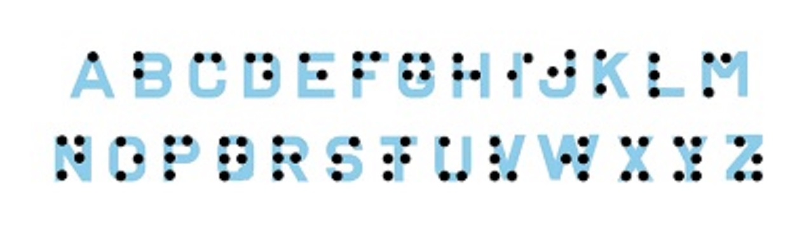

# Proyecto integrador:
Lenguaje: Python.\
Especialidad: Analytic.

# Interprete Braille.
  El braille es un sistema de lectura y escritura táctil pensado para personas ciegas, el mismo se basa en la presencia o ausencia de puntos para la codificación de los símbolos. Mediante seis puntos, también denominado signo generador, se pueden obtener hasta 64 combinaciones diferentes y la presencia o ausencia de punto en cada posición es quien determina de qué letra del alfabeto se trata.  

# Entrada del sistema.
Desde la pantalla de inicio se invita al usuario a ingresar la criptomoneda a monitorear, luego, la app consumirá una API de Binance
(uno de los exchanges más grandes del mundo) donde obtendrá el precio de dicha criptomoneda y lo ira graficando a tiempo real dentro de una ventana de tiempo
de 1 minuto(Trending).\
-A modo de prueba(test) durante el trending de la criptomoneda es posible forzar su flash crash pulsando la letra (t).

# Salida del sistema.
En caso de detectarse el flash crash de la criptomoneda ingresada se enviara al usuario una notificación por SMS(*).

El trending continuara durante un 1 minuto más y el grafico se cerrara automáticamente al completarse el registro en la BD.

# Nota.
En este proyecto está orientado a integrar en una aplicación los conocimientos adquiridos durante el cursado de los 11 módulos de la especialidad Python Analytic.

# Contacto.
Discord ID: PabloP#2073
