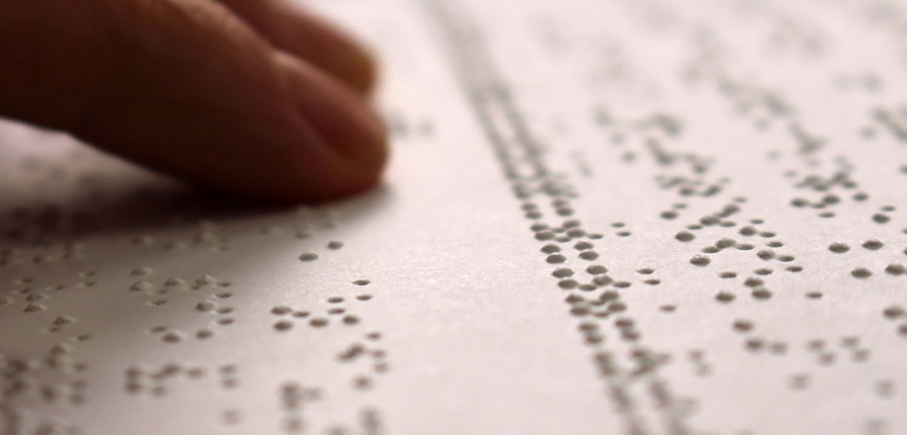
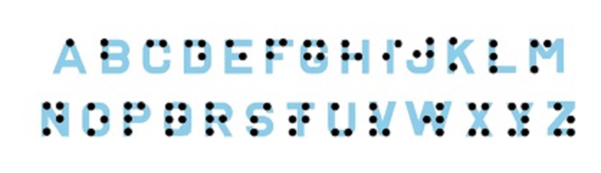

# Proyecto integrador:
Lenguaje: Python.\
Especialidad: Analytic.

# Interprete Braille.
  El braille es un sistema de lectura y escritura táctil pensado para personas ciegas, el mismo se basa en la presencia o ausencia de puntos para la codificación de los símbolos. Mediante seis puntos, también denominado signo generador, se pueden obtener hasta 64 combinaciones diferentes y la presencia o ausencia de punto en cada posición es quien determina de qué letra del alfabeto se trata.
  

# Descripción de la aplicación.
La aplicación(app.py) fue desarrollada para utilizar la cámara frontal de un celular (modo horizontal) como scanner de un texto en braille. Una vez focalizado el mismo, presionado TRADUCIR se realiza la captura e inicia el proceso de traducción, al finalizar, el texto traducido aparecerá en pantalla junto con su pronunciación.\
Se adjunta el siguiente video a modo ilustrativo: 

# Nota.
En este proyecto está orientado a integrar en una aplicación los conocimientos adquiridos durante el cursado de los 11 módulos de la especialidad Python Analytic.

# Contacto.
Discord ID: PabloP#2073
